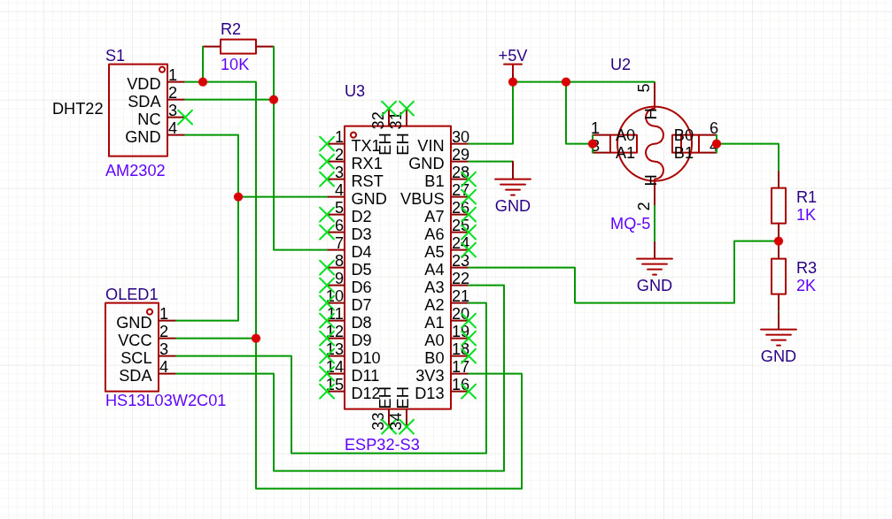
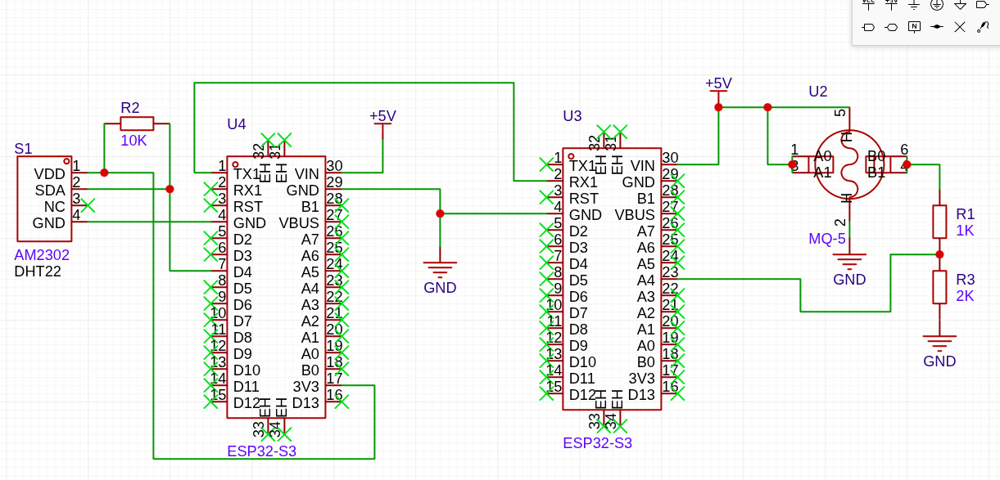
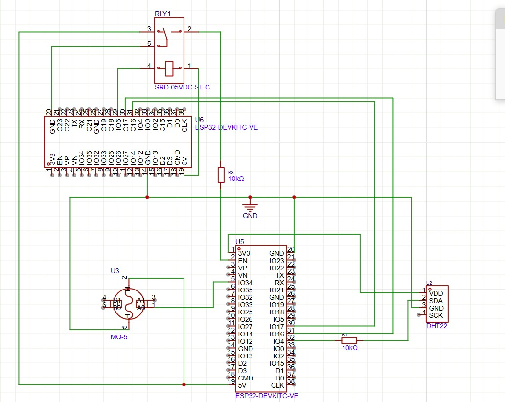

# ICS 4111: Embedded Systems & IoT
## Semester Project

**Group Name:** Waystar  

 

---

**Course:** ICS 4111 — Embedded Systems & IoT (Apr–Jul 2026)  
**Objective:** Identify requirements that support individual flower growth and develop schematic designs of embedded devices.

---

## 1. Tulip Environmental Requirements

Tulips are spring-blooming bulbous perennials that thrive under specific environmental conditions. The following research documents the optimal parameters for healthy tulip growth.

### 1.1 Environmental Parameter Descriptions

**a. Optimal Temperature Range**  
Tulips are cool-season flowers that require cold vernalisation periods to bloom properly. They prefer cool spring temperatures for blooming and need cold winters (or refrigerated bulb storage) to initiate flowering. Temperatures above 20 °C can shorten bloom duration and cause premature wilting. Growth is best between 9 °C and 12 °C, while bulb development requires a chilling period of 12–16 weeks at 2–7 °C.

**b. Optimal Relative Humidity Range**  
Tulips prefer moderate humidity. Excessively high humidity promotes fungal diseases such as Botrytis (grey mould), while very low humidity can cause dehydration of bulbs and wilting of blooms. The optimal range is **40–70% relative humidity**.

**c. Recommended Soil Type**  
Tulips grow best in well-draining, sandy or sandy-loam soils that prevent waterlogging of the bulbs. Heavy clay soils retain too much moisture and cause bulb rot. Loamy soils with added organic matter (compost) provide good structure, drainage, and moderate nutrient retention.

**d. Optimal Soil Moisture Content**  
Soil should be consistently moist during the active growing season (spring) but never waterlogged. After blooming, the soil should be allowed to dry out as foliage dies back. Optimal volumetric water content (VWC) is approximately **30–50%**, corresponding to a sensor reading that indicates moist but not saturated conditions.

**e. Optimal Soil pH Range**  
Tulips prefer a slightly acidic to neutral soil pH. Values outside this range can inhibit nutrient uptake, particularly phosphorus and iron. Ideal pH is between **6.0 and 7.0**, with 6.5 being widely regarded as optimal.

**f. Suitable Sunlight Exposure**  
Tulips require full sun to partial shade. Insufficient sunlight causes elongated, weak stems (etiolation). Optimal growth occurs with **6–8 hours** of direct or bright indirect sunlight per day. In hot climates, afternoon shade can protect blooms from heat stress.

**g. LPG / Gas Considerations**  
While tulips are not directly affected by low-level atmospheric LPG, monitoring ambient gas concentrations (methane, butane, propane) in enclosed growing environments (greenhouses) is important for safety and air quality. Elevated concentrations can indicate gas leaks, poor ventilation, or combustion events that compromise both plant health and human safety. Safe ambient LPG levels should remain **below 1,000 ppm**.

---

### 1.2 Tulip Environmental Parameters Reference Table

| Parameter | Optimal Range | Notes |
|---|---|---|
| Temperature | 9 °C – 12 °C (growth); 2 °C – 7 °C (vernalisation) | Avoid temperatures above 20 °C during bloom |
| Relative Humidity | 40% – 70% RH | High humidity (>80%) promotes Botrytis mould |
| Soil Type | Sandy loam / Well-draining loam | Avoid heavy clay; add organic matter/compost |
| Soil Moisture Content (VWC) | 30% – 50% | Allow to dry after bloom period |
| Soil pH | 6.0 – 7.0 | Optimal at 6.5 |
| Sunlight Exposure | 6 – 8 hours/day | Full sun preferred; afternoon shade in hot climates |
| Ambient LPG Level | < 1,000 ppm | Safety threshold; monitor in enclosed environments |

---

## 2. Hardware Components

The following tables list all hardware components required to build the embedded monitoring device. Components cover sensing, processing, display, actuation, and prototyping.

### 2.1 Sensors & Actuators

| Component | Quantity | Purpose |
|---|---|---|
| ESP32S DevKIT WIFI + BLE Module (30-Pin) | 2 | Microcontroller / processing unit; Wi-Fi & Bluetooth communication |
| DHT22 (AM2302) Temperature & Humidity Sensor | 1 | Measures ambient temperature and relative humidity |
| MQ-5 LPG / Natural Gas Sensor | 1 | Detects LPG (methane, butane, propane) concentration |
| Capacitive Soil Moisture Sensor (v1.2) | 1 | Measures volumetric soil moisture content |
| Soil pH Sensor Module | 1 | Measures soil pH level |
| BH1750 Ambient Light Sensor (I²C) | 1 | Measures sunlight / lux level for sunlight exposure tracking |
| DS18B20 Waterproof Temperature Sensor | 1 | Measures soil temperature |

### 2.2 Display & Output

| Component | Quantity | Purpose |
|---|---|---|
| 1.3" White IIC 128×64 OLED LCD Display (SH1106) | 1 | Displays real-time sensor readings locally |
| 5V 1-Channel Low Level Trigger Relay Module | 1 | Controls actuators (irrigation pump, fan, grow light) |
| Active Buzzer Module | 1 | Audible alert for out-of-range readings |

### 2.3 Passive Components

| Component | Quantity | Purpose |
|---|---|---|
| 10 kΩ Resistor | 5 | Pull-up/pull-down resistors (DHT22 data line, relay, etc.) |
| 4.7 kΩ Resistor | 2 | Pull-up for I²C lines (SDA/SCL) |
| 100 Ω Resistor | 2 | Current-limiting resistors |
| 10 µF Electrolytic Capacitor | 3 | Power supply decoupling |
| 100 nF (0.1 µF) Ceramic Capacitor | 5 | High-frequency bypass/decoupling |
| 1N4007 Flyback Diode | 1 | Protects relay coil from back-EMF |
| Voltage Divider (10 kΩ + 10 kΩ) | 1 | Scales 5 V MQ-5 output to 3.3 V for ESP32 ADC |

### 2.4 Power Supply

| Component | Quantity | Purpose |
|---|---|---|
| 5V / 2A USB Power Adapter | 1 | Primary power source |
| AMS1117-3.3V LDO Voltage Regulator | 1 | Provides stable 3.3 V rail |
| 18650 Li-Ion Battery + Holder | 1 | Backup / portable power |

### 2.5 Prototyping Tools

| Component | Quantity | Purpose |
|---|---|---|
| Full-Size Breadboard (830 tie-points) | 2 | Circuit prototyping |
| Half-Size Breadboard (400 tie-points) | 1 | Secondary circuit prototyping |
| Male-to-Male Jumper Wires (20 cm) | 40 | Breadboard connections |
| Male-to-Female Jumper Wires (20 cm) | 20 | Sensor-to-breadboard connections |
| Female-to-Female Jumper Wires (20 cm) | 10 | Module connections |
| Multimeter | 1 | Voltage/continuity testing |
| USB Micro-B Cable | 2 | Programming and power for ESP32 |

---

## 3. Component Datasheets

The following links provide datasheets and technical documentation for the primary components listed in the project specification.

### 3.1 Required Components (per project brief)

| Component | Datasheet / Reference Link |
|---|---|
| 1.3" White IIC 128×64 OLED LCD (SH1106) | [Datasheet (PDF)](https://www.rajguruelectronics.com/Product/4437/OLED%204%20PIN%20128x64%20display%20module%201.3%20inch%20white.pdf) |
| ESP32S DevKIT WIFI + BLE Module (30-Pin) | [Datasheet (PDF)](https://www.espressif.com/sites/default/files/documentation/esp32_datasheet_en.pdf) |
| DHT22 AM2302 Temperature and Humidity Sensor | [Datasheet (PDF)](https://www.sparkfun.com/datasheets/Sensors/Temperature/DHT22.pdf) |
| MQ-5 LPG, Natural Gas, Coal Gas Sensor | [Datasheet (PDF)](https://www.winsen-sensor.com/d/files/MQ-5.pdf) |
| 5V 1-Channel Low Level Trigger Relay Module | [Datasheet (PDF)](https://www.rajguruelectronics.com/Product/1730/1%20channel%20relay%20board%20with%20high%20low%20level%20trigger.pdf) |

---

## 4. Schematic Diagrams

The following schematic diagrams illustrate three distinct embedded system architectures using the components listed in Section 3.

### 4a. Diagram A — Single Node: ESP32S + MQ-5 + DHT22 + OLED LCD

> **Description:** One ESP32S microcontroller is connected to one MQ-5 gas sensor, one DHT22 temperature/humidity sensor, and one 1.3" OLED LCD display. 

<!-- The MQ-5 analog output is passed through a 10 kΩ / 10 kΩ voltage divider before reaching the ESP32 ADC pin. The DHT22 data line uses a 10 kΩ pull-up resistor to the 3.3 V rail. The OLED communicates via I²C (SDA/SCL) with 4.7 kΩ pull-up resistors. Decoupling capacitors (100 nF ceramic) are placed at each sensor VCC pin. -->

---

### 4b. Diagram B — Two-Node Direct: ESP32S (MQ-5) ↔ ESP32S (DHT22)

> **Description:** Two ESP32S modules communicate directly (via UART or ESP-NOW/Wi-Fi). The first ESP32S interfaces with the MQ-5 sensor (with voltage divider). The second ESP32S interfaces with the DHT22 sensor.

<!-- (with 10 kΩ pull-up). The two nodes exchange sensor data wirelessly or via serial connection. -->

---

### 4c. Diagram C — Relay-Bridged Chain: ESP32S (DHT22) → Relay → ESP32S (MQ-5)

> **Description:** The first ESP32S is connected to the DHT22 sensor and controls a 5V relay module. The relay output line is connected to the second ESP32S, which interfaces with the MQ-5 sensor. 

<!-- A 1N4007 flyback diode protects the relay coil. This architecture demonstrates actuation-triggered data flow between nodes. -->

### Meeting Proof

---
