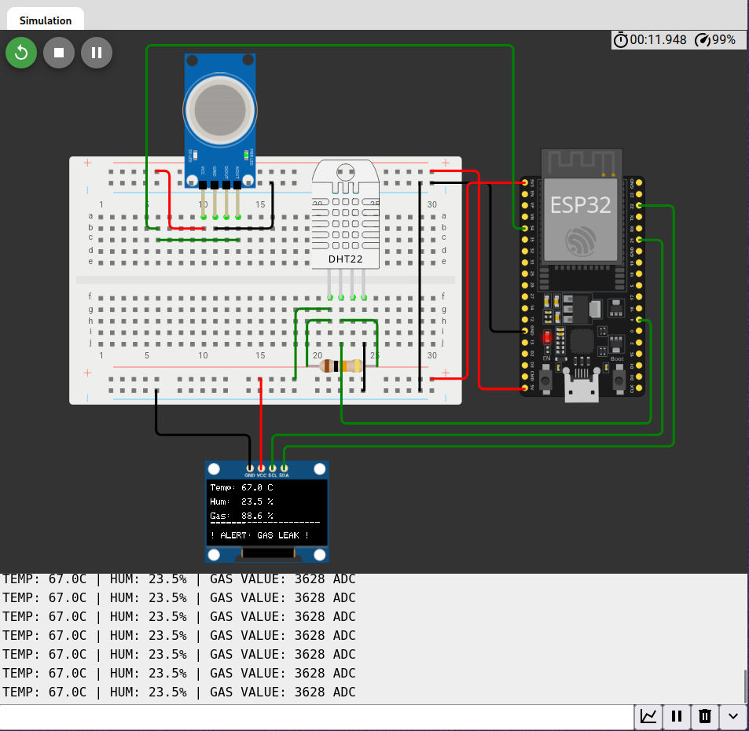
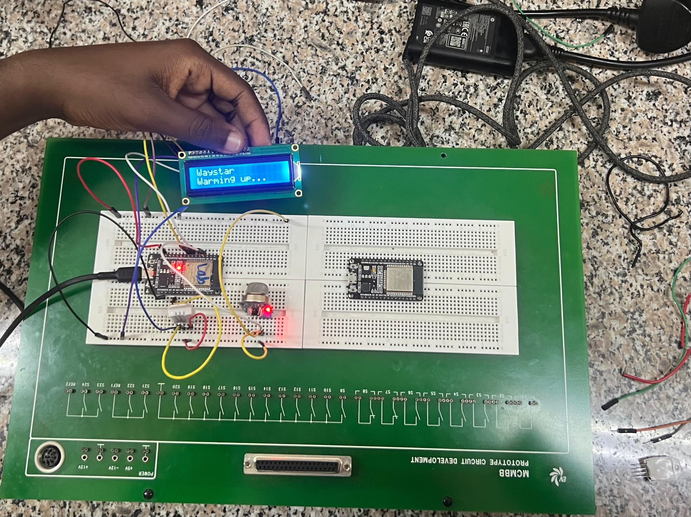
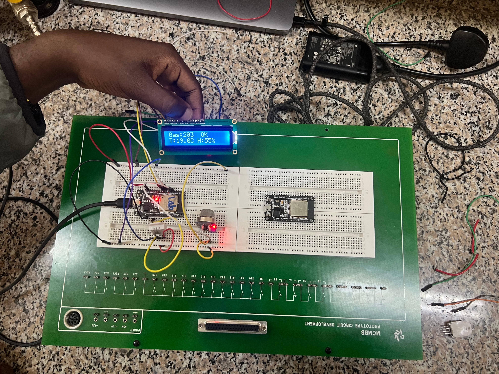
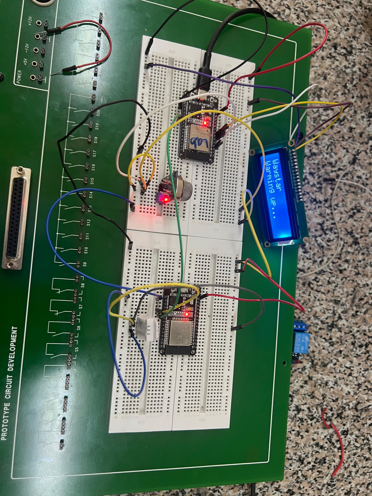
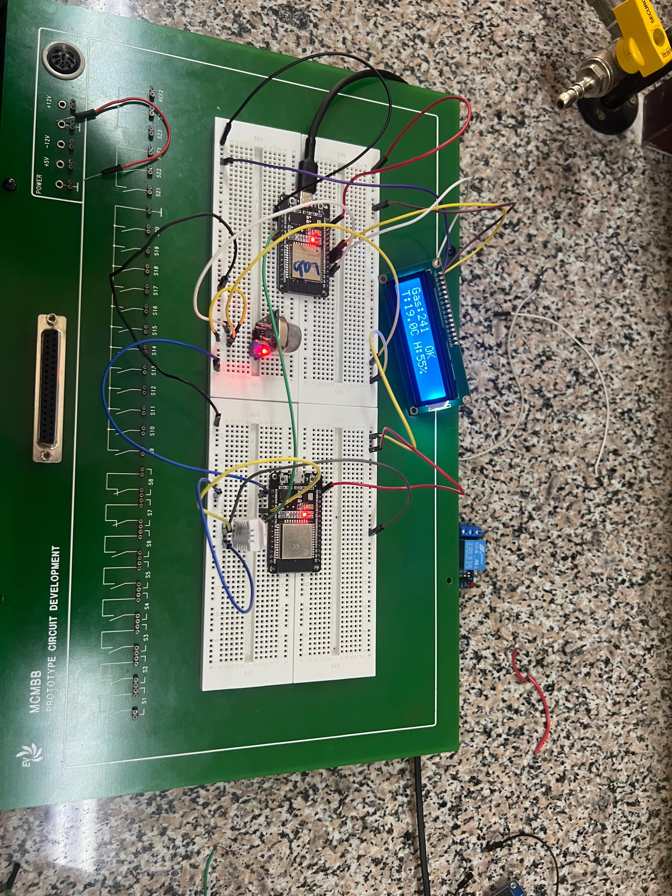

# ICS 4111: Embedded Systems & IoT
## Semester Project

**Group Name:** Waystar  

 

---

## Project Overview
This deliverable focuses on transforming the schematics from Deliverable 1 into working physical and simulated prototypes. The project explores three device architectures utilizing the ESP32S microcontroller, a DHT22 temperature/humidity sensor, an MQ-5 gas sensor, an LCD screen, and a relay module.

---

## Architecture A: Single ESP32S Integrated System
**Description:** A single ESP32S connected concurrently to 1 MQ-5 sensor, 1 DHT22 sensor, and 1 LCD screen. 

### 1. Simulated Model (Wokwi)
* **Wokwi Project Link:** https://wokwi.com/projects/468021051566990337

### 2. Physical Model
* **Hardware Setup & LCD Output:**

---

## Architecture B: Direct ESP32S-to-ESP32S Interfaced System
**Description:** 1 ESP32S connected to an MQ-5 sensor, interfaced directly via GPIO/Serial communication with a second ESP32S connected to a DHT22 sensor.

> **Note:** As per instructions, Architectures B and C are interchangeable. We selected a **Physical** implementation for this setup .

### Prototype Implementation
    

---

## Architecture C: Relay-Isolated Dual ESP32S System
**Description:** 1 ESP32S connected to a DHT22 sensor controlling a relay module, which triggers/interfaces with a second ESP32S connected to an MQ-5 sensor.

> **Note:** Because Architecture B was built as a Physical model, Architecture C has been completed as a **Simulated** model to meet the minimum 4-prototype requirement.

### Prototype Implementation
* **Wokwi Link (If simulated):** [Insert Wokwi Link or N/A]
* **Prototype & Output Display:**
    

---

## Engineering Log: Prototyping Challenges & Debugging
*This section documents any technical issues faced during implementation.*

| Problem Identified | Solutions Explored | Recommended / Final Resolution | Status |
| :--- | :--- | :--- | :--- |
| *Example: MQ-5 sensor drawing too much current, causing ESP32S brownout.* | *Tried powering via ESP32 3V3 rail.* | *Sourced external 5V breadboard power supply with common ground.* | **Resolved** |
| *Example: I2C LCD not rendering text.* | *Checked pull-up resistors and scanned for correct I2C address.* | *Address was 0x27 instead of 0x3F; updated code.* | **Resolved** |
| [Insert Issue] | [Insert Solution] | [Insert Recommendation] | [Open/Resolved] |

---